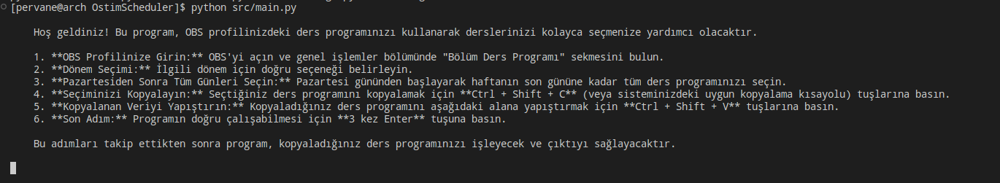
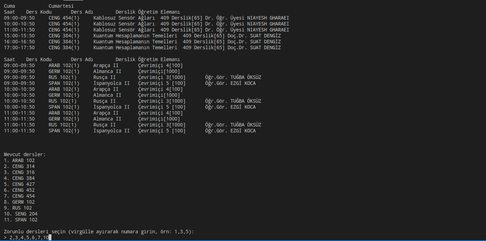
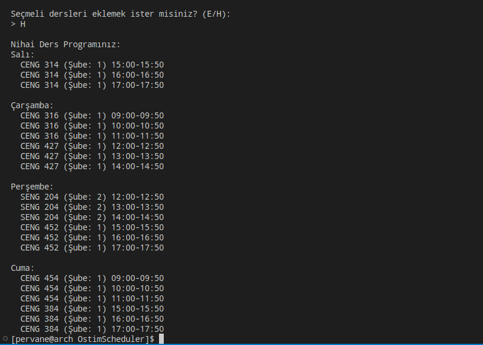

# OstimScheduler
This project allows students at OSTİM Technical University to easily generate their course schedules.

# Course Scheduler

## Project Description
This project is a Python application that processes the course schedule taken from the OBS profile and assists the user in course selection.

## Features
- Formats the course schedule
- Option to select mandatory courses
- Support for adding elective courses
- Prevents conflicting courses
- User-friendly interface

## Usage
1. Copy your course schedule from your OBS profile
2. Run the program
3. Select the mandatory courses
4. Add optional elective courses

## Requirements
- Python 3.7+

## Installation
```bash
git clone https://github.com/4ni1ak/OstimScheduler
cd course-scheduler
pip install -r requirements.txt
python src/main.py
```

## License
Apache License 2.0
---
## Some screenshots from the program






